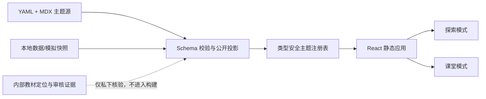

# GeoQuest V1 架构

## 1. 架构目标

GeoQuest V1 是公开静态站点：无应用服务器、业务数据库、身份系统、云端学习记录或动态 CMS。内容在构建阶段校验和编译，浏览器只加载当前路由需要的页面、交互和自托管快照。

## 2. 固定技术基线

- React、TypeScript strict、Vite、React Router。
- YAML + MDX 内容，经 Zod 或等价运行时 schema 在构建前校验。
- ECharts 处理常规图表；MapLibre 只通过 `MapProviderAdapter` 使用。
- D3 仅用于 ECharts 无法合理实现的定制交互，并记录理由。
- CSS Modules 与设计令牌；不引入大型 UI 框架。
- pnpm 管理 Node 环境；UV 管理后续 Python 数据加工环境。

生产环境自托管脚本、样式、字体和关键素材，不使用公共 CDN、分析脚本、Cookie 或第三方追踪。

## 3. 内容边界

内容分四层：

| 层 | 用途 | 是否公开 |
|---|---|---|
| `CatalogEntry` | 66 个长期候选的脱敏目录 | 可公开摘要 |
| `InternalTopicRecord` | 教材/课标精确定位、审核人与证据 | 否 |
| `TopicManifestSource` | 仓库中的主题 YAML/MDX 源 | 是，须脱敏 |
| `PublicTopicManifest` | 白名单投影后的浏览器清单 | 是 |

公开投影不得包含教材或课标源文件名、内部页码、内部证据路径、本机路径或私有素材。开发模式可以显示“开发中”主题；生产注册表只收录通过发布门禁的主题。

## 4. 来源模型

`SourceRef` 是按 `kind` 判别的联合类型：

- `reference`：事实参考，记录发布方、原始网址和核验日期。
- `dataset`：外部数据集，另有版本、范围、许可、署名、本地快照、加工步骤和 SHA-256。
- `map`：地图资产，记录版本、审图信息、是否修改及地图审核。
- `media`：图片、视频、音频或字体，记录创作者、许可、署名和修改。
- `simulation`：原创教学模拟，记录方法、版本、参数和局限。

审核对象使用 `unreviewed | initial | approved | blocked`。只有内部审核记录同时存在审核人、日期和证据时才能成为 `approved`；公开清单只暴露必要的脱敏审核摘要。

## 5. 构建与数据流

1. 读取公开 YAML/MDX、组件声明和本地快照元数据。
2. 校验 ID、slug、入口、原型、核心素养、四段式契约、来源和状态。
3. 校验数据快照校验值、来源许可、模拟方法与地图门禁。
4. 通过字段白名单生成 `PublicTopicManifest`；扫描内部字段和机器路径。
5. 按主题生成懒加载注册表，构建 React 静态站点。
6. 对构建产物再次执行公开边界、外部请求和性能检查。

浏览器不在运行时获取 MDX/YAML。核心交互默认读取本地快照；可选在线更新失败时回到同一快照，不改变核心结论路径。

## 6. 路由与模式

- `/`：首页。
- `/textbooks`、`/textbooks/:volume`：教材探索。
- `/topics`、`/topics/:slug`：目录与主题。
- `/labs/maps`、`/labs/data`、`/labs/earth`：地图、数据和地球实验室。
- `/regions`、`/challenges`：区域探索与地理挑战。
- `/classroom`：公开课堂使用指南，不含登录。
- `/sources`：来源、方法和局限。
- `/settings`：本机偏好与一键清除。

课堂模式由 `?mode=classroom` 解析，不能产生第二份主题内容。路由深链接由静态托管 SPA 回退和 React Router 共同处理；应用内保留站内 404。

## 7. 状态与隐私

localStorage 仅允许 `geoquest:` 命名空间的展示偏好、匿名结构化完成状态和 schema 版本。证据卡保存在当前会话，可打印或导出不含身份的结构化 JSON；自由文本反思不持久化。

应用提供清除本主题进度和清除全部本机数据。不得调用浏览器精确定位，不上传学习记录，不使用 Cookie 或设备指纹。

## 8. 可访问性与降级

- 交互全部可由键盘完成；滑杆提供数值/按钮替代，地图提供列表、方向按钮或数据表替代。
- 图表启用可访问性描述并提供文字摘要/数据表。
- 尊重 `prefers-reduced-motion`；断网或 WebGL 不可用时提供静态图、表格或数值路径。
- 同时覆盖 360×640 移动端和 1366×768 课堂投屏。

## 9. 性能与部署

首页初始应用 JavaScript gzip 后目标不超过 350 KB；地图、图表、主题和较大数据按路由/交互加载。首页不预取全部主题数据。

生产站部署到 Cloudflare Pages：`main` 为生产分支，构建命令 `pnpm run build`，输出 `dist`。不放置顶层静态 `404.html`，由 Pages SPA 回退支持深链接；React 负责站内 404。暂不绑定自定义域名或启用 Web Analytics。

生产构建不发布包含 `sourcesContent` 的 source map，避免 authoring manifest、审核字段和内部构建源码随静态资源公开。边界检查在构建前后各运行一次，并直接扫描被 Git 忽略的 `dist`。

安全响应头至少包括 Content-Security-Policy、Referrer-Policy、X-Content-Type-Options 和 Permissions-Policy，并按实际自托管资源收紧来源。
